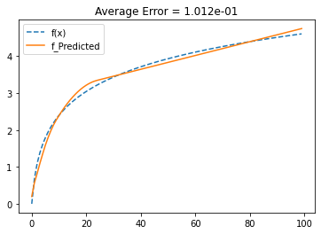

# Monte-Carlo-Neural-Nets

## Overview

A package made to see how well a basic architecture of neural nets could be. The nets can be created with custom input and output heights, as well as full customization of the hidden layers' sizes (height and count of layers).

The basic operation of these nets is that they can be trained to some data set (or not, currently working on a 'self-training' chess AI example) by randomly 'tweaking' the different parameter weight values within the net. These weight values are clipped to be restrained to the range [-1, 1].

By defualt, a RELU-type function is applied at every layer calculation to give non-linearites such that more advanced calculations are actually possible.

This is on PyPI, view the latest release at:
https://pypi.org/project/mcnets/

## Curve Fitting
### Old Method (choppy RELU)
Training Details:
- Net Size = 1176 parameters
- Training Time = 420 s

Result:

Training Details:
- Net Size = 312 params.
- Training Time = 18.1 s

Result:

