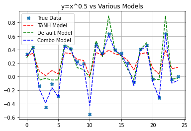
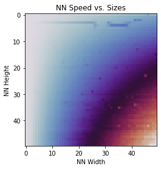
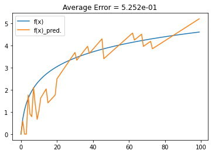
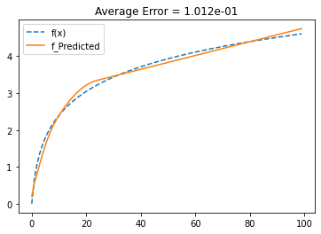

# Monte-Carlo-Neural-Networks

## Overview / Lore

A package made to see how well a basic architecture of neural nets could be. The basis of training these neural network models comes not from various gradient descent methods, but instead a unique Monte-Carlo style training optimizer.

Written fully in Python, this doesn't represent a 1-1 replacement for other common models, regressors, classifiers, etc. out there due to speed differences. However, for small data sets (About 1000s of samples or less, it depends) the primary model (MCRegressor) has a very similar speed and capability as others (such as models in SKLearn). Further, due to the training style, the networks tend to not overfit by default and seem to reliably keep their predictive power as fitting continues. 

Overall this package represents a place of testing unique frameworks and ideas for Deep Learning Neural Network models. Whether you want to test a custom activation function, training method, neural network model, etc., the framework of the package allows for it. Especially considering that is what I initially used this package for, before it was uploaded as a package

I will continue to try new things for this package making use of this monte-carlo training 'philosophy'. Some of the current new things I'm testing include a SUNN (Super-Unique Neural Network) model that allows for using a different activation function on every individual node, and a function that automatically finds a few optimal activation function orders for a given model and dataset.

This is on PyPI, view the latest release at:
https://pypi.org/project/mcnets/

## Quickstart
### Example Code (Curve Fitting to f(x) = x^0.5 - 0.75)
Following the training algorithm enchancement of V1.0.0, there has been a few renamings, functions fixes, scoring function metrics improved, and more. Below is the quick start code that shows various syntax, equivalent statements, etc. This is most of what is needed to be able to use these networks, but there is more to show in other niche cases (I.e. the SUNN regressor that is ((I believe)) my original idea that I'm currently BETA testing).

Some of the models below use possible RELU and SIG replacements, being SILU and dSILU respectively (see [Elfwing, et al.] at the end of the quick start code).

```
import matplotlib.pyplot as plt
import numpy as np
import mcnets as mc

## CONTEXT ##
# The below shows how to setup the models, fit them, and show their predictions
# Most of this is essentially the same as other common packages out there
# 
# For this simple dataset, 3 models are made and fitted (to 50% of the data)
# with the total results graphed. Note how models that use the same activation
# for all layers (tanh model) aren't very good models. The default model (see
# details below) tends to preform the 2nd best, and the combination model
# using dSILU (Elfwing, et al.) tends to preform the best

# Data to fit to (f(x) = x^0.5 - 0.75)
# You can increase the number of samples by changing the X variable
np.random.seed(2024)
X = np.random.rand(25)*2 # Gives domain of [0, 2)
Y = X**0.5 - 0.75

# Assemble a few models to test
net_tanh  = mc.MCNeuralNetwork([25], activations='tanh')         # All layers use TANH activation (this is a bad idea, limits output to [-1, 1])
net_silu   = mc.MCNeuralNetwork([25], activations="DEFAULT")     # Default activations is lin/SILU/.../lin
net_combo = mc.MCNeuralNetwork([25], ['relu', 'dsilu', 'lin'])    # Uses a combination of activations

# An equal alternative definition for the TANH model:
# net_tanh = MCNeuralNetwork([25], ['tanh', 'tanh', 'tanh'])

# An equal alternative definition for the SILU model (lin/SILU/.../lin is default):
# net_silu = MCNeuralNetwork([25])  

# Train-Test Split (Taking only the train group)
xt, xv, yt, yv = mc.TTSplit(X, Y, percentTrain=50)

# fit the models to the training data group
print("TANH Model Training:")
net_tanh.fit(xt, yt, useFast=False)

print("\nDefault Model Training:")
net_silu.fit(xt, yt)

print("\nCombo Model Training")
net_combo.fit(xt, yt)

# Get the models predictions to the full data set
ym_tanh  = net_tanh.predict(X, useFast=False)
ym_silu   = net_silu.predict(X)
ym_combo = net_combo.predict(X)

# Plot and compare the results of the models
print("\nPlotted Results:")
plt.plot(Y, 'X')
plt.plot(ym_tanh, 'r--')
plt.plot(ym_silu, 'g--')
plt.plot(ym_combo, 'b--')

plt.grid(True)
plt.title(f"y=x^0.5 vs Various Models")
plt.legend(["True Data", "TANH Model", "Default Model", "Combo Model"])

plt.show()

# SILU Reference
# 1. SILU and dSILU activation functions
# Stefan Elfwing, Eiji Uchibe, Kenji Doya,
# Sigmoid-weighted linear units for neural network function approximation in reinforcement learning,
# Neural Networks,
# Volume 107,
# 2018,
# Pages 3-11,
# ISSN 0893-6080,
# https://doi.org/10.1016/j.neunet.2017.12.012.
# (https://www.sciencedirect.com/science/article/pii/S0893608017302976)
```

On my machines, this all runs in well under a second and will output the following comparision graph:



## Speed Tests
### Convention
A speed test was completed on what I like to refer to as 'rectangular' neural nets. This is, excluding the input and output layer sizes, each hidden layer has some size/height H and there are W layers (the net has a hidden 'width' of W). So, again excluding in/out sizes as they will be the same, the nets can be referenced as their hidden size of HxW. For example, a net with sizes 1x12x12x12x1 (in and out size of 1) as used in the above quickstart example can be thought of as a 12x3 net.

### Results
Using this convention, a test was conducted on 50^2 nets, that is, with H and W ranging from 1 to 50. The test simply consisted of performing the same numerical calculation (using the .Calculate() method) 100 times with the same net, and then recorded the mean calculation time. This test was done on all of the 2500 different nets which took a few minutes as the median calculation time was about 1.2 ms (1.2ms * 100 * 2500 = 5 mins). Here is the pretty heat map that sums up the results better than the entirety of this paragraph if I kept rambling:



Note that the cooler colors are faster, and the warmer colors are slower times.

The most important takeaway is that 'tall' and 'wide' nets of equal parameters take significantly different times. That is, having only a few hidden layers that are tall (ie. like a 12x3 net) is faster than the reverse with a similar number of parameters (ie. like a 5x13 net). It is quite worse, in fact:

Net 1:
- Shape = 12x3
- Param.s = 312
- Avg. calculation time = 49.2 microseconds

Net 2:
- Shape = 5x13
- Param.s = 310
- Avg. calculation time = 124 microseconds


## Legacy Curve Fitting Examples
It is worth noting that before V0.2.1, directly fitting a netork to the values for curve fitting was either a nightmare or not really possible (First Method below). Now with many changes to the activations functions, net customizability, training algorithm, etc. it is quite straight forward. Further, with the acitvation-function-set optimizer I'm currently implementing, it is extremely easy to fit a model to a data set in just a few lines.

For the sake of demonstrating progress, below are two points in time before these additions where using the networks was not as convenient. These (compared to the quickstart results now) shoe just how far the package's training method (and my understanding of it all!) have come.

### First (choppy) Method
The original way I used these nets for curve fitting was by taking advantage of the non-linear behavior of the RELU calculation. At the time, I also had an ELU option implemented, but it didn't give me any useful fit back. This method worked and did allow the net to have some "intelligence" to fit to the given data, but it was very choppy at best and required massive nets to do an okay-ish job. Below is a "short" training session example of what it gives.

Training Details:
- Net Size = 1176 parameters
- Training Time = 213.4 s

Result:



### Second Method (fitting slopes using ELU)
The new method still makes use of the AdvNet, but instead of directly using the output as some sort of "y" value, the output is used as a sort of rough derivative estimator (ie. a slope) that gets added to the previous point. By finding the points this way, using the ELU hidden function, much nicer results can be generated. Also importantly, note the much smaller net and training time as compared to above.

Training Details:
- Net Size = 312 params.
- Training Time = 18.1 s

Result:


