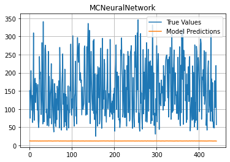

# Monte-Carlo-Neural-Networks

## Overview

An extremely lightweight machine learning package with various models and tools. Install using:

```pip install mcnets```

Originally a hobby project, this has become an approach to training neural networks that are on par with models such as the MLPRegressor featured in SciKit-Learn. Instead of using methods like backpropagation for training, a basis of random (Monte Carlo-like) modifications is made to find improvements.

An exciting extension of this training method is that it can be applied to any machine learning model that consists of groups of numerical parameters/coefficients (i.e. the weights and biases in neural networks). The SOUP models are an example of some other high-preforming models that use the same exact training method.

View the PyPI release at:
https://pypi.org/project/mcnets/

## Current Ability
Before V2.0.0, directly comparing the old neural network model (MCNeuralNetwork) to something like the MLPRegressor in SciKit-Learn just wasn't fair. However, with the new speed and accuracy improvements that warranted removing all V1.5.0 and earlier models, the comparison is now equal in a variety of situations.

The information below is for a test of the current NeuralNetwork, SKlearn's MLPRegressor and the old MCNeuralNetwork models fitted to the same data (sklearn load_diabetes) scored off of a 10-CV cross-validation.

### NeuralNetwork (Current Package NN; Huge Improvements from Pre-V2.0.0)
- Time Training: 3.4s!
- CV R^2 Score (1 is best): 0.4718 +- 0.1040


### MLPRegressor (From SciKit-Learn; For Comparison)
- Time Training: 44.5s
- CV R^2 Score (1 is best): 0.4763 +- 0.1301


### MCNeuralNetwork (First Monte Carlo NN Attempt ;))
- Time Training: 22.6s
- CV R^2 Score (1 is best): -2.8694 +- 0.8680



## Quickstart Code
Below is a quick code meant to show a few ways to make the NeuralNetwork and SOUP models, and use them in a cross-validation with the built-in cross_val function.

```
import mcnets as mc
import numpy as np
from time import perf_counter as pc
from sklearn.datasets import load_diabetes

# Get data
X, y = load_diabetes(return_X_y=True)

# Base Neural Network (Uses one hidden layer of 100 units with ReLU)
m1 = mc.NeuralNetwork(hidden_counts=(100), activations='relu')

# Base Neural Network with early stopping tolerances (see docstring)
m2 = mc.NeuralNetwork(hidden_counts=(100), activations='relu', quad_tol=-0.015, tri_tol=-0.012)

# Various ways activation functions can be given besides the avalible strings
m3 = mc.NeuralNetwork(hidden_counts=(25, 10, 25), activations=[(lambda x: np.maximum(x, -0.5)), ('elu'), (np.tanh)])

# Example of other hyperparams; This one tends to do the best and is the fastest by far! Hyperparam optimization =)
m4 = mc.NeuralNetwork(hidden_counts=[10, 10, 10], activations=['lin', 'linear', 'identity'], input_acti='lin',
                      output_acti='lin', max_iter=1000, learning_rate_init=0.8, learning_rate_mode='adaptive',
                      n_iter_no_change=100, l2_reg=0, l1_reg=0, dropout=0.01, validation_fraction=0, 
                      early_stopping=True, quad_tol=-0.04, tri_tol=-0.01, verbose=False)

# 'SOUP' Regressor Custom Model (see docstring)
m5 = mc.SoupRegressor(use_tan=False, max_iter=100, dropout=0, learning_rate_init=15,
                      learning_rate_mode='adaptive', n_iter_no_change=10, use_biases=True,
                      trainable_biases=False, l1_reg=0, l2_reg=0, verbose=False)

# Preform Cross-Validations on all, using R^2 score (Default) and cv=5 (Default)
print("Model 1 Cross-Validation:")
t0 = pc()
cv1 = mc.cross_val(m1, X, y, cv=10, verbose=1)
print(f"Time Taken: {(pc()-t0):2f}s\n")

print("Model 2 Cross-Validation:")
t0 = pc()
cv2 = mc.cross_val(m2, X, y, cv=10, verbose=1)
print(f"Time Taken: {(pc()-t0):2f}s\n")

print("Model 3 Cross-Validation:")
t0 = pc()
cv3 = mc.cross_val(m3, X, y, cv=10, verbose=1)
print(f"Time Taken: {(pc()-t0):2f}s\n")

print("Model 4 Cross-Validation:")
t0 = pc()
cv4 = mc.cross_val(m4, X, y, cv=10, verbose=1)
print(f"Time Taken: {(pc()-t0):2f}s\n")

print("Model 5 Cross-Validation:")
t0 = pc()
cv5 = mc.cross_val(m5, X, y, cv=10, verbose=1)
print(f"Time Taken: {(pc()-t0):2f}s\n")

# Report best model
scores = [cv1.mean(), cv2.mean(), cv3.mean(), cv4.mean(), cv5.mean()]
models = [m1, m2, m3, m4, m5]
best_ind = scores.index(max(scores))

print(f"Best Model: Model {best_ind + 1}")
if best_ind < 4:
    print(f"Hidden Layer Sizes: {models[best_ind].hidden_counts}")
    print(f"Hidden Layer Activations: {[af.__name__ for af in models[best_ind].activations]}")
```

## Speed Tests
Below are some stats on the effective speeds of the old-generation MCNeuralNetworks with various hidden layer dimensions. While the exact speed values and calculation times are no longer relevant, the comparison of models with equal parameters but vastly different dimensions of their hidden layers is still quite important.

### Naming Scheme
A speed test was completed on what I like to refer to as 'rectangular' neural nets. This is, excluding the input and output layer sizes, each hidden layer has some size/height H and there are W layers (the net has a hidden 'width' of W). So, again excluding in/out sizes as they will be the same, the nets can be referenced as their hidden size of HxW. For example, a net with sizes 1x12x12x12x1 (in and out size of 1) as used in the above quickstart example can be considered a 12x3 net.

### Results
Using this convention, a test was conducted on 50^2 nets, that is, with H and W ranging from 1 to 50. The test simply consisted of performing the same numerical calculation (using the .Calculate() method) 100 times with the same net and then recording the mean calculation time. This test was done on all of the 2500 different nets which took a few minutes as the median calculation time was about 1.2 ms (1.2ms * 100 * 2500 = 5 mins). Here is the pretty heat map that sums up the results better than the entirety of this paragraph if I kept rambling:


Note that the cooler colors are faster, and the warmer colors are slower times.

The most important takeaway is that 'tall' and 'wide' nets of equal parameters take significantly different times. That is, having only a few hidden layers that are tall (ie. like a 12x3 net) is faster than the reverse with a similar number of parameters (ie. like a 5x13 net). It is quite worse, in fact:

Net 1:
- Shape = 12x3
- Param.s = 312
- Avg. calculation time = 49.2 microseconds

Net 2:
- Shape = 5x13
- Param.s = 310
- Avg. calculation time = 124 microseconds


## Super-Legacy Curve Fitting Examples
It is worth noting that before V0.2.1, directly fitting a network to the values for curve fitting was either a nightmare or not possible (First Method below). Now with many changes to the activation functions, net customizability, training algorithm, etc., it is quite straightforward. Further, with the activation-function-set optimizer I'm currently implementing, it is effortless to fit a model to a data set in just a few lines.

For the sake of demonstrating progress, below are two points in time before these additions when using the networks was not as convenient. These (compared to the quickstart results now) show just how far the package's training method (and my understanding of it all!) has come.

### First (choppy) Method
The original way I used these nets for curve fitting was by taking advantage of the non-linear behavior of the RELU calculation. At the time, I also had an ELU option implemented, but it didn't give me any useful fit back. This method worked and allowed the net to have some "intelligence" to fit the given data, but it was very choppy at best and required massive nets to do an okay-ish job. Below is a "short" training session example of what it gives.

Training Details:
- Net Size = 1176 parameters
- Training Time = 213.4 s

Result:


### Second Method (fitting slopes using ELU)
The new method still makes use of the AdvNet, but instead of directly using the output as some sort of "y" value, the output is used as a sort of rough derivative estimator (ie. a slope) that gets added to the previous point. By finding the points this way, using the ELU hidden function, much nicer results can be generated. Also importantly, note the much smaller net and training time as compared to above.

Training Details:
- Net Size = 312 params.
- Training Time = 18.1 s

Result:


